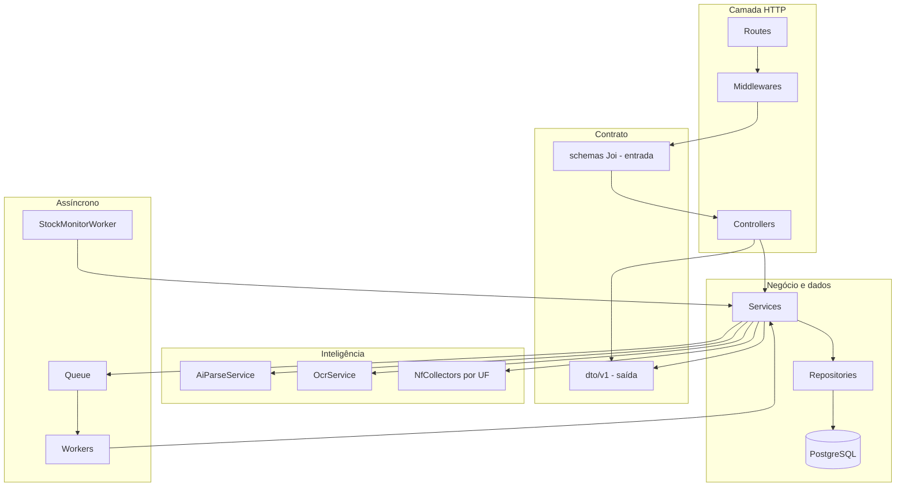

# Estoque Inteligente — Documentação do Back-end

Documentação da API do Estoque Inteligente. O back-end autentica o usuário, interpreta entradas (texto/IA, QR NF-e, foto/OCR), mantém estoque e financeiro, gera listas de compras, monitora níveis e conversa via chat.

**Stack v1** (alinhada ao padrão Neoenergia / Prospector):

| Item | Escolha |
|------|---------|
| Runtime | Node.js 20+ |
| Framework HTTP | Express 5 |
| Validação | Joi (`schemas/`) + regras nos **services** |
| Resposta da API | `dto/v1/` |
| Banco | PostgreSQL (`pg`) |
| Filas | BullMQ + Redis (OCR, NF, monitor) |
| Auth | JWT + bcrypt (ou Argon2id se alinhado ao front Neoenergia) |
| IA | OpenAI-compatible API (parse, OCR assistido, chat) |
| Upload | multer + storage local/S3 |
| Logs | **Winston** (arquivos + console; níveis por env) |
| Docs da API | **Swagger / OpenAPI** (`swagger-ui-express` + spec; Fase 1) |
| E-mail | **Nodemailer** (SMTP) — transacional |
| HTTP externo | axios |
| HTML parser | cheerio (portais SEFAZ) |

---

## 1. Arquitetura em camadas



| Camada | Responsabilidade | Não deve fazer |
|--------|------------------|----------------|
| **Routes** | URL → middlewares → controller | SQL, regra de negócio |
| **Middlewares** | Auth, Joi, erros, upload | Acesso direto ao banco |
| **Controllers** | Request/response HTTP | Lógica complexa, SQL |
| **Schemas (Joi)** | Formato body/query | Regras que dependem do banco |
| **Services** | Negócio, orquestração, **retorna DTO** | SQL direto |
| **DTO** | camelCase, omite segredos | Acessar banco |
| **Repositories** | Queries SQL / CRUD | Regra de negócio |
| **Collectors** | Portais NF por UF | Persistência direta |
| **AI / OCR** | Extrair JSON estruturado | Responder HTTP |
| **Jobs/Workers** | Intake pesado, monitor | Responder HTTP |

### 1.1 Joi vs DTO

| | **Joi (`schemas/`)** | **DTO (`dto/v1/`)** |
|---|----------------------|---------------------|
| **Direção** | Entrada HTTP | Saída HTTP |
| **Quando** | Middleware, antes do controller | Service, antes do `res.json()` |
| **Exemplo** | texto do intake, UUID | `min_quantity` → `minQuantity` |

---

## 2. Estrutura de pastas

```
estoque-inteligente-api/
├── .env.example
├── .gitignore
├── package.json
├── database.sql
│
└── src/
    ├── index.js
    ├── app.js
    │
    ├── config/
    │   ├── db.js
    │   ├── env.js
    │   ├── redis.js
    │   ├── queue.js
    │   └── storage.js
    │
    ├── routes/
    │   ├── index.js
    │   ├── authRoutes.js
    │   ├── userRoutes.js
    │   ├── productRoutes.js
    │   ├── intakeRoutes.js
    │   ├── stockOutRoutes.js
    │   ├── shoppingListRoutes.js
    │   ├── financeRoutes.js
    │   ├── notificationRoutes.js
    │   ├── chatRoutes.js
    │   └── dashboardRoutes.js
    │
    ├── controllers/
    │   ├── AuthController.js
    │   ├── UserController.js
    │   ├── ProductController.js
    │   ├── IntakeController.js
    │   ├── StockOutController.js
    │   ├── ShoppingListController.js
    │   ├── FinanceController.js
    │   ├── NotificationController.js
    │   ├── ChatController.js
    │   └── DashboardController.js
    │
    ├── services/
    │   ├── AuthService.js
    │   ├── OAuthService.js
    │   ├── GoogleAuthService.js
    │   ├── AppleAuthService.js
    │   ├── UserService.js
    │   ├── ProductService.js
    │   ├── IntakeService.js
    │   ├── IntakeConfirmService.js
    │   ├── StockOutService.js
    │   ├── StockOutConfirmService.js
    │   ├── ProductMatcherService.js
    │   ├── ShoppingListService.js
    │   ├── FinanceService.js
    │   ├── NotificationService.js
    │   ├── ChatService.js
    │   ├── DashboardService.js
    │   ├── StockMonitorService.js
    │   ├── AiParseService.js
    │   ├── OcrService.js
    │   ├── NfIntakeService.js
    │   └── EmailService.js
    │
    ├── repositories/
    │   ├── UserRepository.js
    │   ├── UserAuthIdentityRepository.js
    │   ├── PasswordResetTokenRepository.js
    │   ├── ProductRepository.js
    │   ├── ProductAliasRepository.js
    │   ├── StockIntakeRepository.js
    │   ├── StockOutRepository.js
    │   ├── StockMovementRepository.js
    │   ├── PurchaseRepository.js
    │   ├── ShoppingListRepository.js
    │   ├── NotificationRepository.js
    │   └── ChatRepository.js
    │
    ├── dto/v1/
    │   ├── authDto.js
    │   ├── userDto.js
    │   ├── productDto.js
    │   ├── intakeDto.js
    │   ├── stockOutDto.js
    │   ├── shoppingListDto.js
    │   ├── financeDto.js
    │   ├── notificationDto.js
    │   ├── chatDto.js
    │   └── dashboardDto.js
    │
    ├── middlewares/
    │   ├── validateSchema.js
    │   ├── validateAuthentication.js
    │   ├── validateOwnership.js
    │   ├── uploadReceipt.js
    │   ├── requestLogger.js
    │   └── errorHandler.js
    │
    ├── schemas/
    │   ├── authSchemas.js
    │   ├── userSchemas.js
    │   ├── productSchemas.js
    │   ├── intakeSchemas.js
    │   ├── stockOutSchemas.js
    │   ├── shoppingListSchemas.js
    │   └── chatSchemas.js
    │
    ├── collectors/
    │   ├── nf/
    │   │   ├── NfCollectorFactory.js
    │   │   ├── BaseNfCollector.js
    │   │   ├── GenericAccessKeyCollector.js
    │   │   ├── SpNfCollector.js
    │   │   ├── BaNfCollector.js
    │   │   └── ... (por UF prioritária)
    │   └── NfUrlParser.js
    │
    ├── jobs/
    │   └── workers/
    │       ├── intakeWorker.js
    │       └── stockMonitorWorker.js
    │
    ├── mail/
    │   ├── mailer.js
    │   └── templates/
    │       ├── welcome.js
    │       ├── resetPassword.js
    │       └── stockDigest.js
    │
    ├── utils/
    │   ├── AppError.js
    │   ├── asyncHandler.js
    │   ├── pagination.js
    │   ├── stockStatus.js
    │   └── logger.js
    │
    ├── constants/
    │   ├── categories.js
    │   ├── units.js
    │   └── brazilStates.js
    │
    └── helpers/
        ├── hashPassword.js
        └── signToken.js
```

---

## 3. Dependências (`package.json`)

```json
{
  "name": "estoque-inteligente-api",
  "version": "1.0.0",
  "main": "src/index.js",
  "scripts": {
    "start": "node src/index.js",
    "dev": "nodemon src/index.js",
    "worker:intake": "node src/jobs/workers/intakeWorker.js",
    "worker:monitor": "node src/jobs/workers/stockMonitorWorker.js"
  },
  "dependencies": {
    "axios": "^1.13.4",
    "bcrypt": "^6.0.0",
    "bullmq": "^5.34.5",
    "cheerio": "^1.0.0",
    "cors": "^2.8.5",
    "dotenv": "^17.2.3",
    "express": "^5.2.1",
    "google-auth-library": "^9.0.0",
    "ioredis": "^5.6.1",
    "joi": "^18.0.2",
    "jsonwebtoken": "^9.0.3",
    "jwks-rsa": "^3.1.0",
    "multer": "^2.0.0",
    "nodemailer": "^6.10.0",
    "openai": "^4.0.0",
    "pg": "^8.17.1",
    "winston": "^3.17.0"
  },
  "devDependencies": {
    "nodemon": "^3.1.11"
  }
}
```

---

## 4. Bootstrap e configuração

### 4.1 `src/index.js`

```javascript
require("dotenv").config();
const app = require("./app");
const env = require("./config/env");

app.listen(env.PORT, () => {
  console.log(`[estoque-inteligente-api] running on port ${env.PORT}`);
});
```

### 4.2 `src/app.js`

```javascript
const express = require("express");
const cors = require("cors");
const setRoutes = require("./routes");
const errorHandler = require("./middlewares/errorHandler");
const env = require("./config/env");

const app = express();

app.use(cors({ origin: env.CORS_ORIGIN }));
app.use(express.json({ limit: "2mb" }));
app.use(require("./middlewares/requestLogger"));

app.get("/health", (_req, res) => res.json({ status: "ok" }));

setRoutes(app);

app.use(errorHandler);

module.exports = app;
```

### 4.3 `src/config/env.js`

```javascript
const Joi = require("joi");

const schema = Joi.object({
  NODE_ENV: Joi.string().valid("development", "production", "test").default("development"),
  PORT: Joi.number().default(3001),
  DATABASE_URL: Joi.string().required(),
  REDIS_URL: Joi.string().required(),
  JWT_SECRET: Joi.string().required(),
  JWT_EXPIRATION: Joi.string().default("7d"),
  CORS_ORIGIN: Joi.string().default("http://localhost:5173"),
  GOOGLE_CLIENT_ID: Joi.string().required(),
  APPLE_CLIENT_ID: Joi.string().required(),
  APPLE_TEAM_ID: Joi.string().allow(""),
  APPLE_KEY_ID: Joi.string().allow(""),
  OPENAI_API_KEY: Joi.string().required(),
  OPENAI_MODEL: Joi.string().default("gpt-4o-mini"),
  STORAGE_DRIVER: Joi.string().valid("local", "s3").default("local"),
  AI_PARSE_DAILY_LIMIT: Joi.number().default(50),
  AI_CHAT_DAILY_LIMIT: Joi.number().default(40),
  NF_PRIORITY_STATES: Joi.string().default("SP,BA,RJ,MG,PR"),
  LOG_LEVEL: Joi.string().valid("error", "warn", "info", "http", "debug").default("info"),
  SMTP_HOST: Joi.string().allow(""),
  SMTP_PORT: Joi.number().default(587),
  SMTP_SECURE: Joi.boolean().default(false),
  SMTP_USER: Joi.string().allow(""),
  SMTP_PASS: Joi.string().allow(""),
  SMTP_FROM: Joi.string().default("Estoque Inteligente <noreply@estoqueinteligente.app>"),
  MAIL_ENABLED: Joi.boolean().default(false),
}).unknown(true);

const { value, error } = schema.validate(process.env);
if (error) throw new Error(`Config inválida: ${error.message}`);
module.exports = value;
```

---

## 5. Middlewares (padrão Prospector)

- `validateSchema` — Joi genérico
- `validateAuthentication` — JWT → `req.user`
- `validateOwnership` — garante que `product`/`intake`/`list` pertencem a `req.user.id`
- `uploadReceipt` — multer para foto do cupom
- `requestLogger` — log HTTP via Winston (`method`, `path`, `status`, `durationMs`, `userId`)
- `errorHandler` + `AppError` + `asyncHandler`

Toda query de domínio **sempre** filtra por `user_id = req.user.id`.

---

## 5.0 Logs (Winston) e e-mail (Nodemailer)

### `src/utils/logger.js`

**Por que existe:** logs estruturados em vez de `console.log` solto — alinhado ao Neoenergia (Winston).

```javascript
const winston = require("winston");
const env = require("../config/env");

const logger = winston.createLogger({
  level: env.LOG_LEVEL,
  format: winston.format.combine(
    winston.format.timestamp(),
    winston.format.errors({ stack: true }),
    winston.format.json(),
  ),
  defaultMeta: { service: "estoque-inteligente-api" },
  transports: [
    new winston.transports.Console({
      format: env.NODE_ENV === "production"
        ? winston.format.json()
        : winston.format.combine(winston.format.colorize(), winston.format.simple()),
    }),
  ],
});

module.exports = logger;
```

| Uso | Exemplo |
|-----|---------|
| Request | `requestLogger` middleware |
| Erros | `errorHandler` → `logger.error(...)` |
| Jobs | workers logam início/fim/falha |
| IA / NF | warn em rate limit, falha de collector |

### `src/mail/mailer.js` + `EmailService`

**Por que existe:** e-mails transacionais (boas-vindas, reset de senha, digest de alertas).

| Gatilho | Template | Fase |
|---------|----------|------|
| Cadastro / 1º login social | `welcome` | 1–2 |
| Esqueci minha senha | `resetPassword` | 2 |
| Digest diário/semanal de alertas | `stockDigest` | 2 (opt-in) |

```javascript
// EmailService.js (esqueleto)
class EmailService {
  async sendWelcome(user) { /* se MAIL_ENABLED */ }
  async sendPasswordReset(user, resetUrl) {}
  async sendStockDigest(user, alerts) {}
}
```

Regras:

- Se `MAIL_ENABLED=false` → no-op + log `info` (dev sem SMTP)
- Nunca logar senha/token em texto puro
- Preferência `notify_email_digest` em `user_preferences` para digest

### Endpoints relacionados a e-mail

| Método | Rota | Função |
|--------|------|--------|
| POST | `/api/auth/forgot-password` | Envia e-mail de reset (fase 2) |
| POST | `/api/auth/reset-password` | Consome token do e-mail |

Persistência do reset em `password_reset_tokens` (guarda **hash** do token, `expires_at`, `used_at`) via `PasswordResetTokenRepository`. Regras:

- `forgot-password`: invalida tokens não usados do usuário, cria novo (TTL 30–60 min) e chama `EmailService.sendPasswordReset`. Responde 200 mesmo se o e-mail não existir (não vaza cadastro).
- `reset-password`: valida hash + `expires_at` + `used_at IS NULL`, grava novo `password_hash` e marca `used_at`.

Schemas Joi (`authSchemas`):

```javascript
const forgotPasswordSchema = Joi.object({
  email: Joi.string().email().required(),
});

const resetPasswordSchema = Joi.object({
  token: Joi.string().required(),
  password: Joi.string().min(8).max(128).required(),
});
```

---

## 5.1 Autenticação (local + OAuth)

### Fluxo recomendado (v1)

O front obtém o **id_token** do Google ou Apple via SDK oficial e envia ao backend. O backend **valida o token** (nunca confia só no e-mail vindo do client) e emite o JWT da aplicação.

```
Front (SDK Google/Apple)
  → id_token
  → POST /api/auth/google | /api/auth/apple
  → Backend valida token com Google/Apple
  → findOrCreateUser(profile)
  → JWT + UserDto
```

### `OAuthService.findOrCreateUser`

```javascript
async findOrCreateUser({ provider, providerUserId, email, name, emailVerified, avatarUrl }) {
  // 1. Buscar por (provider, providerUserId)
  let identity = await UserAuthIdentityRepository.findByProvider(provider, providerUserId);
  if (identity) return AuthService.issueSession(identity.user_id);

  // 2. Buscar usuário por e-mail (unificar contas)
  let user = email ? await UserRepository.findByEmail(email) : null;

  if (!user) {
    user = await UserRepository.create({ name, email, avatar_url: avatarUrl, password_hash: null });
    await UserPreferencesRepository.createDefaults(user.id);
    await EmailService.sendWelcome(user); // no-op se MAIL_ENABLED=false
  }

  await UserAuthIdentityRepository.create({
    user_id: user.id,
    provider,
    provider_user_id: providerUserId,
    email,
    email_verified: emailVerified,
  });

  return AuthService.issueSession(user.id);
}
```

### Google (`GoogleAuthService`)

- Validar `idToken` com `google-auth-library` (`OAuth2Client.verifyIdToken`)
- Audience = `GOOGLE_CLIENT_ID`
- Extrair: `sub`, `email`, `name`, `picture`, `email_verified`

### Apple (`AppleAuthService`)

- Validar `id_token` JWT com chaves públicas da Apple (JWKS)
- Audience = `APPLE_CLIENT_ID` (Services ID no web; Bundle ID no app nativo futuro)
- Extrair: `sub`, `email` (pode ser relay), `email_verified`
- Nome: só na **primeira** autorização — front pode enviar `fullName` no body na 1ª vez

### Schemas Joi

```javascript
const oauthTokenSchema = Joi.object({
  idToken: Joi.string().required(),
  fullName: Joi.string().max(150).allow(null), // Apple 1ª vez
});
```

### Endpoints auth

| Método | Rota | Função |
|--------|------|--------|
| POST | `/api/auth/register` | Cadastro e-mail/senha |
| POST | `/api/auth/login` | Login e-mail/senha |
| POST | `/api/auth/google` | Login/cadastro Google (`idToken`) |
| POST | `/api/auth/apple` | Login/cadastro Apple (`idToken`, `fullName` opcional) |
| GET | `/api/auth/me` | Sessão + provedores vinculados |
| POST | `/api/auth/link/google` | Vincular Google (usuário já logado) |
| POST | `/api/auth/link/apple` | Vincular Apple (usuário já logado) |
| POST | `/api/users/me/password` | Definir/trocar senha (se aplicável) |

Resposta de login (todos os métodos):

```json
{
  "token": "jwt...",
  "user": {
    "id": "uuid",
    "name": "Rafael",
    "email": "rafa@email.com",
    "avatarUrl": "https://...",
    "authProviders": ["google"]
  },
  "isNewUser": true
}
```

`isNewUser: true` quando foi **cadastro automático** no 1º login social — o front pode mostrar tooltip de boas-vindas, sem formulário.

---

## 6. Schemas Joi (exemplos)

### 6.1 Intake por linguagem natural (compra)

```javascript
const parseNaturalLanguageSchema = Joi.object({
  text: Joi.string().min(3).max(4000).required(),
});
```

### 6.1b Baixa por linguagem natural (consumo)

```javascript
const parseConsumeTextSchema = Joi.object({
  text: Joi.string().min(3).max(4000).required(),
});

const confirmStockOutSchema = Joi.object({
  items: Joi.array().items(
    Joi.object({
      id: Joi.string().uuid().allow(null),
      productId: Joi.string().uuid().required(),
      name: Joi.string().min(1).max(200).required(),
      quantity: Joi.number().positive().required(),
      unit: Joi.string().required(),
      excluded: Joi.boolean().default(false),
      allowZero: Joi.boolean().default(false), // se qtd > estoque, zerar
    }),
  ).min(1).required(),
});
```

> O mesmo `AiParseService` pode expor `parseIntake(text)` e `parseConsume(text)` com prompts diferentes (`action: "add" | "consume"`).

### 6.1c Confirmar intake (compra)

```javascript
const confirmIntakeSchema = Joi.object({
  storeName: Joi.string().max(200).allow("", null),
  purchasedAt: Joi.date().iso().allow(null),
  items: Joi.array().items(
    Joi.object({
      id: Joi.string().uuid().allow(null),
      productId: Joi.string().uuid().allow(null),
      name: Joi.string().min(1).max(200).required(),
      quantity: Joi.number().positive().required(),
      unit: Joi.string().required(),
      category: Joi.string().allow(null),
      unitPrice: Joi.number().min(0).allow(null),
      excluded: Joi.boolean().default(false),
    }),
  ).min(1).required(),
});
```

### 6.2 QR / chave NF

```javascript
const parseNfQrSchema = Joi.object({
  qrContent: Joi.string().uri().required(),
  stateCode: Joi.string().length(2).uppercase().allow(null),
});
```

### 6.3 Produto (edição pontual)

```javascript
const updateProductSchema = Joi.object({
  name: Joi.string().min(1).max(200),
  category: Joi.string(),
  quantity: Joi.number().min(0),
  unit: Joi.string(),
  minQuantity: Joi.number().min(0),
  repurchaseDays: Joi.number().integer().min(1).allow(null),
  notes: Joi.string().allow("", null),
  active: Joi.boolean(),
}).min(1);

const consumeProductSchema = Joi.object({
  quantity: Joi.number().positive().required(),
  note: Joi.string().allow("", null),
});
```

---

## 7. Routes e mapa de endpoints

Prefixo: `/api`.

| Método | Rota | Função |
|--------|------|--------|
| POST | `/api/auth/register` | Cadastro e-mail/senha |
| POST | `/api/auth/login` | Login e-mail/senha |
| POST | `/api/auth/google` | Login/cadastro Google |
| POST | `/api/auth/apple` | Login/cadastro Apple |
| GET | `/api/auth/me` | Sessão |
| POST | `/api/auth/link/google` | Vincular Google |
| POST | `/api/auth/link/apple` | Vincular Apple |
| POST | `/api/auth/forgot-password` | Envia e-mail de reset (fase 2) |
| POST | `/api/auth/reset-password` | Consome token e define nova senha (fase 2) |
| PATCH | `/api/users/me` | Editar perfil |
| POST | `/api/users/me/password` | Trocar senha |
| DELETE | `/api/users/me` | Encerrar conta |
| GET | `/api/products` | Listar / filtrar |
| GET | `/api/products/:id` | Detalhe + histórico |
| PATCH | `/api/products/:id` | Editar |
| POST | `/api/products/:id/consume` | Baixa |
| POST | `/api/products/:id/consume-usual` | Baixa com `avg_weekly_usage` / ciclo (atalho do nudge) |
| POST | `/api/products/:id/mark-out` | Zerar (“acabou”) |
| POST | `/api/intakes/parse-text` | IA texto → draft **compra** |
| POST | `/api/intakes/parse-nf-qr` | QR → draft (async ok) |
| POST | `/api/intakes/parse-photo` | multipart foto → draft |
| GET | `/api/intakes/:id` | Preview compra |
| PATCH | `/api/intakes/:id` | Editar itens draft |
| POST | `/api/intakes/:id/confirm` | Persistir estoque+financeiro |
| POST | `/api/intakes/:id/cancel` | Cancelar draft |
| POST | `/api/stock-outs/parse-text` | IA texto → draft **baixa** |
| GET | `/api/stock-outs/:id` | Preview baixa |
| PATCH | `/api/stock-outs/:id` | Editar itens draft |
| POST | `/api/stock-outs/:id/confirm` | Persistir movements `out` |
| POST | `/api/stock-outs/:id/cancel` | Cancelar draft |
| GET | `/api/shopping-lists/active` | Lista ativa |
| POST | `/api/shopping-lists/generate` | Regenerar (regras/IA) |
| PATCH | `/api/shopping-lists/items/:id` | Check / editar |
| GET | `/api/finance/summary` | Semana/mês |
| GET | `/api/finance/series` | Série temporal |
| GET | `/api/finance/tips` | Dicas simples |
| GET | `/api/notifications` | Listar |
| POST | `/api/notifications/:id/read` | Marcar lida |
| POST | `/api/notifications/read-all` | Marcar todas |
| GET | `/api/chat/sessions` | Sessões |
| POST | `/api/chat/sessions` | Nova sessão |
| POST | `/api/chat/sessions/:id/messages` | Enviar mensagem |
| GET | `/api/dashboard/stats` | Cards + gráficos |

---

## 8. Controllers (finos)

Padrão: receber HTTP → chamar service → `res.json(dto)`.

```javascript
class IntakeController {
  async parseText(req, res) {
    const intake = await IntakeService.parseNaturalLanguage(req.user.id, req.body.text);
    return res.status(201).json(intake);
  }

  async parsePhoto(req, res) {
    const intake = await IntakeService.parseReceiptPhoto(req.user.id, req.file);
    return res.status(201).json(intake);
  }

  async confirm(req, res) {
    const result = await IntakeConfirmService.confirm(req.user.id, req.params.id, req.body);
    return res.status(200).json(result);
  }
}
```

---

## 9. Services principais

### 9.1 `AiParseService`

**Por que existe:** transforma texto (ou texto OCR) em JSON de itens normalizados.

Dois modos:

| Método | Intenção | `action` no JSON |
|--------|----------|------------------|
| `parseIntake(text)` | adicionar ao estoque | `add` |
| `parseConsume(text)` | dar baixa | `consume` |

**Exemplo consume** — input: *“dê baixa em uma lata de leite, em 200g de queijo, em 1 azeite”*

```json
{
  "action": "consume",
  "items": [
    { "name": "Leite", "quantity": 1, "unit": "lata", "confidence": 0.92 },
    { "name": "Queijo", "quantity": 200, "unit": "g", "confidence": 0.9 },
    { "name": "Azeite", "quantity": 1, "unit": "un", "confidence": 0.88 }
  ]
}
```

Regras:

- Prompt com unidades/categorias + lista resumida dos produtos do usuário (melhora match)
- Validar JSON com Joi interno
- Rate limit diário compartilhado para parse de entrada e baixa — contadores no **Redis** (chave `ai:{userId}:{yyyy-mm-dd}`, limites `AI_PARSE_DAILY_LIMIT` / `AI_CHAT_DAILY_LIMIT`); tabela `ai_usage_quotas` fica para quando houver billing
- Em falha: `AppError` 422 com mensagem amigável

### 9.2 `IntakeService`

Fluxos:

1. **Texto:** `AiParseService` → cria `stock_intakes` (`draft`) + items → `ProductMatcherService` sugere `productId`
2. **QR:** `NfUrlParser` extrai UF/chave → `NfCollectorFactory` → itens → draft
3. **Foto:** salva mídia → enfileira job OCR **ou** processa sync na v1 pequena → draft

Sempre retorna `IntakeDetailDto` (preview).

### 9.2b `StockOutService` / `StockOutConfirmService`

Fluxo espelhado ao intake, para consumo:

1. `parseNaturalLanguage(userId, text)` → `AiParseService.parseConsume` → match em produtos existentes → draft `stock_outs`
2. Itens sem match: `warning: product_not_found` (usuário escolhe produto no preview ou exclui)
3. Se `quantity > available`: `warning: exceeds_stock`
4. `confirm`: para cada item não excluído, cria `stock_movements` tipo `out`, atualiza `quantity` / `last_consumed_at` / padrões de uso

```javascript
class StockOutController {
  async parseText(req, res) {
    const draft = await StockOutService.parseNaturalLanguage(req.user.id, req.body.text);
    return res.status(201).json(draft);
  }

  async confirm(req, res) {
    const result = await StockOutConfirmService.confirm(req.user.id, req.params.id, req.body);
    return res.status(200).json(result);
  }
}
```

### 9.3 `NfCollectorFactory` + collectors por UF

```javascript
class NfCollectorFactory {
  static for(stateCode, qrUrl) {
    const map = {
      SP: SpNfCollector,
      BA: BaNfCollector,
      // ...
    };
    const Collector = map[stateCode] || GenericAccessKeyCollector;
    return new Collector();
  }
}
```

| Comportamento | Detalhe |
|---------------|---------|
| UF detectada | da URL ou posições 0–1 / cUF na chave |
| Sucesso | lista `{ name, quantity, unit, unitPrice }` |
| Falha / captcha | `AppError` 502 + log em `nf_collector_logs` + front sugere foto |
| Prioridade v1 | UFs em `NF_PRIORITY_STATES` |

### 9.4 `IntakeConfirmService`

Transação:

1. Valida ownership + status `draft`
2. Aplica edições do body (itens excluídos ignorados)
3. Para cada item: find/create `products`, create alias se nome diferente
4. `stock_movements` tipo `in`
5. Atualiza `quantity`, `last_purchased_at`, `avg_unit_price`
6. Se houver preços: `purchases` + `purchase_items`
7. Marca intake `confirmed`
8. Dispara avaliação de alertas / atualiza lista (opcional)

### 9.5 `ProductMatcherService`

Matching por:

1. Alias exato (`product_aliases`)
2. Similaridade `pg_trgm` no nome (threshold configurável)
3. Se match: `productId` + `matchedExisting: true`

### 9.6 `ShoppingListService`

`generate(userId, { mode: 'rules' | 'ai' })`:

- **rules:** produtos `out`/`low` + recompra por tempo
- **ai:** envia resumo do estoque ao LLM e mescla com regras
- Upsert na lista `active` (arquiva ou limpa itens não checked conforme política)

### 9.7 `ChatService`

1. Persiste mensagem do usuário
2. Monta contexto: top produtos críticos + lista ativa + gastos recentes (resumo curto)
3. LLM com tools/intenções: `answer`, `propose_shopping_list`, `propose_intake`, `propose_consume`
4. Resposta + `payload` acionável no DTO (ex.: `{ type: "stock_out_draft", id }`)

### 9.8 `StockMonitorService` (job periódico)

Para cada usuário ativo (respeitando `user_preferences`):

| Tipo | Quando gera |
|------|-------------|
| `low_stock` / `out_of_stock` | quantidade vs `min_quantity` |
| `repurchase_reminder` | `last_purchased_at` + `repurchase_days` |
| `consumption_nudge` | nenhuma baixa (`out`) nos últimos `consumption_nudge_days` |
| `missing_consumption` | produto com `avg_weekly_usage` / `consumption_cycle_days` e sem `out` na janela |

**Regras de nudge de baixa:**

1. **Genérico** — título/corpo no estilo: *“Não esqueceu de dar baixa em algum produto?”*  
   Payload: `{ action: "open_quick_consume" }` (abre seletor de produtos recentes).
2. **Por padrão** — *“Você costuma usar cerca de 1 kg de arroz por semana, mas esta semana ainda não registrou baixa”*  
   Payload: `{ productId, suggestedQuantity, unit, action: "consume_usual" }`.
3. **Deduplicação** — não repetir o mesmo `type` + `product_id` (ou nudge genérico) se já houver não lida nas últimas 24–72h.
4. **Agrupamento** — se ≥ 3 produtos com `missing_consumption`, uma notificação única: *“3 itens sem baixa recente”* + lista no payload.
5. **Atualização de padrões** — job (ou pós-`consume`) recalcula `last_consumed_at`, `avg_weekly_usage` e `consumption_cycle_days` com base nos últimos N movimentos `out` (mín. 2–3 amostras antes de criar `missing_consumption`).

Também exposto internamente como `ConsumptionPatternService` (pode ser método do monitor ou service separado).

### 9.9 `FinanceService`

- `summary`: totais semana/mês, por categoria, delta vs período anterior
- `series`: buckets diários/semanais
- `tips`: regras determinísticas na v1 (“categoria X subiu Y%”)

### 9.10 `DashboardService`

Agrega cards + séries + “próximas recompras” + últimas entradas + contagem de nudges de baixa pendentes.

---

## 10. DTO (exemplos)

### ProductListDto

```javascript
const ProductListDto = (row) => ({
  id: row.id,
  name: row.name,
  category: row.category,
  quantity: Number(row.quantity),
  unit: row.unit,
  minQuantity: Number(row.min_quantity),
  stockStatus: stockStatus(row.quantity, row.min_quantity),
  avgUnitPrice: row.avg_unit_price != null ? Number(row.avg_unit_price) : null,
  lastPurchasedAt: row.last_purchased_at,
  lastConsumedAt: row.last_consumed_at,
  avgWeeklyUsage: row.avg_weekly_usage != null ? Number(row.avg_weekly_usage) : null,
  repurchaseDays: row.repurchase_days,
});
```

### IntakeDetailDto

```javascript
const IntakeDetailDto = (intake, items) => ({
  id: intake.id,
  source: intake.source,
  status: intake.status,
  stateCode: intake.state_code,
  storeName: intake.store_name || null,
  items: items.map(IntakeItemDto),
  createdAt: intake.created_at,
});
```

API sempre **camelCase**. Front consome sem transformar.

---

## 11. Jobs

| Worker | Fila | Responsabilidade |
|--------|------|------------------|
| `intakeWorker` | `intake-pipeline` | OCR + IA em fotos; NF lenta |
| `stockMonitorWorker` | cron / repeatable | Alertas diários |

HTTP pode:

- Processar texto **síncrono** (rápido)
- Enfileirar foto/NF e retornar intake `draft` em processamento → front faz polling `GET /api/intakes/:id`

---

## 12. Fluxo de requisição (exemplo)

**POST `/api/intakes/parse-text`**

```
1. validateAuthentication → req.user
2. validateSchema(parseNaturalLanguage)
3. IntakeController.parseText
4. IntakeService.parseNaturalLanguage
   ├── rate limit IA
   ├── AiParseService.parse(text)
   ├── ProductMatcherService.matchAll(userId, items)
   ├── StockIntakeRepository.createDraft(...)
   └── IntakeDetailDto
5. res.status(201).json(dto)
```

**POST `/api/intakes/:id/confirm`**

```
1. auth + ownership
2. Joi confirmIntakeSchema
3. IntakeConfirmService.confirm (transaction)
4. ProductList summary / purchase DTO
```

---

## 13. Convenções

| Convenção | Regra |
|-----------|-------|
| Prefixo | `/api/...` |
| SQL | só em `repositories/` |
| Entrada | Joi |
| Saída | `dto/v1/` |
| Erro de negócio | `throw new AppError(...)` |
| Logs | Winston via `utils/logger.js` — sem `console.log` em produção |
| E-mail | `EmailService` + Nodemailer; respeitar `MAIL_ENABLED` |
| Isolamento | sempre `user_id` |
| Preview | draft de compra **ou** baixa nunca altera estoque até o confirm |
| NF por UF | factory + collectors; fallback foto |
| Controllers | finos + `asyncHandler` |

---

## 14. Fora do escopo v1

| Item | Onde fica |
|------|-----------|
| Conta familiar / multi-membro | Fase 3 |
| Código de barras EAN | Fase 4 |
| Push Web completo | Fase 2 |
| Digest de e-mail de alertas | Fase 2 (`MAIL_ENABLED` + opt-in) |
| Billing / planos | Futuro |
| Migrations TypeORM | Opcional; v1 pode usar `database.sql` como Prospector |

---

## 15. Ordem sugerida de implementação

1. `config/`, `logger` (Winston), middlewares (`requestLogger`), auth local + **Google + Apple** + users
2. CRUD `products` + movements manuais (consume) + `last_consumed_at`
3. **Swagger / OpenAPI** (UI + spec; evoluir junto com as rotas da Fase 1)
4. `AiParseService` + intake texto + confirm
5. `StockOutService` + baixa por texto + confirm
6. ~~Dashboard + notifications básicas + monitor~~ ✅
7. Shopping list por regras
8. Finance a partir de preços no confirm
9. `EmailService` (boas-vindas; reset senha na fase 2)
10. Foto/OCR + fila
11. NF QR (UFs prioritárias) + `nf_collector_logs`
12. Padrões de consumo + `missing_consumption`
13. Chat com `propose_intake` e `propose_consume`
14. Digest de e-mail opcional + polish de rate limit
