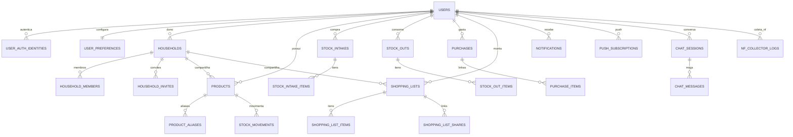

# Estoque Inteligente — Banco de Dados

Documentação do modelo relacional **da entrega atual**.

**Fonte da verdade:** `database.sql` na raiz deste repositório (único script SQL).

| Convenção | Valor |
|-----------|--------|
| SGBD | PostgreSQL 16+ |
| IDs | UUID (`gen_random_uuid`) |
| Datas | `TIMESTAMPTZ` |
| JSON | `JSONB` |
| Seeds no SQL | **Não** — só DDL |
| Catálogos (rótulos) | API no boot (`ensureReferenceData`) |

Escopo de dados: conta **solo** (`user_id`) ou **familiar** (`household_id` em produtos/listas).

---

## Diagrama (visão geral)



---

## ENUMs

| Tipo | Valores (resumo) |
|------|------------------|
| `product_category` | cleaning, hygiene, produce, grocery, dairy, beverages, frozen, household, other |
| `stock_unit` | un, g, kg, ml, l, pack, can, bottle, box, other |
| `intake_source` | natural_language, nf_qr, receipt_photo, manual, chat |
| `stock_out_source` | natural_language, chat, manual, nudge |
| `intake_status` | draft, confirmed, cancelled |
| `movement_type` | in, out, adjust |
| `shopping_list_status` | active, completed, archived |
| `shopping_item_priority` | high, medium, low |
| `shopping_item_origin` | low_stock, out_of_stock, repurchase_time, ai, manual |
| `notification_type` | low_stock, out_of_stock, repurchase_reminder, consumption_nudge, missing_consumption, intake_ready, system |
| `chat_role` | user, assistant, system |
| `account_status` | active, pending_deletion, deleted |
| `auth_provider` | local, google, apple |

---

## Tabelas por domínio

### Conta

| Tabela | Função |
|--------|--------|
| `users` | Conta (perfil, endereço opcional, UF padrão) |
| `user_auth_identities` | Vínculos Google/Apple/local |
| `password_reset_tokens` | Reset de senha (hash do token) |
| `user_preferences` | Alertas, push, quiet hours, digest, locale |

### Família

| Tabela | Função |
|--------|--------|
| `households` | Casa / conta familiar |
| `household_members` | Papéis `owner` \| `member` |
| `household_invites` | Convite por e-mail (token hash) |

### Estoque

| Tabela | Função |
|--------|--------|
| `products` | Item de estoque (`user_id` + `household_id` opcional) |
| `product_aliases` | Nomes alternativos para match |

### Movimentação

| Tabela | Função |
|--------|--------|
| `stock_intakes` / `stock_intake_items` | Compra (rascunho → confirmado) |
| `stock_outs` / `stock_out_items` | Baixa |
| `stock_movements` | Ledger de quantidade |

### Financeiro

| Tabela | Função |
|--------|--------|
| `purchases` / `purchase_items` | Gasto gerado na confirmação da compra |

### Lista

| Tabela | Função |
|--------|--------|
| `shopping_lists` / `shopping_list_items` | Lista ativa (1 por user solo ou por household) |
| `shopping_list_shares` | Link compartilhável (token hash, expiração, revoke) |

### Canais e IA

| Tabela | Função |
|--------|--------|
| `notifications` | Centro in-app |
| `push_subscriptions` | Web Push (endpoint + chaves) |
| `chat_sessions` / `chat_messages` | Assistente |
| `nf_collector_logs` | Observabilidade de coleta NF por UF |

### Catálogos

| Tabela | Função |
|--------|--------|
| `product_categories` | Código + rótulo PT |
| `stock_units` | Código + rótulo |
| `brazilian_states` | UF + nome |

Estrutura criada pelo `database.sql`. Linhas de rótulo garantidas pela API ao subir (`src/bootstrap/ensureReferenceData.js`).

---

## Como aplicar

```bash
# Banco novo (vazio)
psql "$DATABASE_URL" -f database.sql

# Ambiente já existente que precisa “zerar”
psql "$DATABASE_URL" -c "DROP SCHEMA public CASCADE; CREATE SCHEMA public;"
psql "$DATABASE_URL" -f database.sql
```

Depois, subir a API uma vez para popular os catálogos.

---

## Notas

- Não há scripts de migração incremental no repositório: o schema entregue está consolidado em `database.sql`.
- Não há seeds de usuários/produtos de demonstração no repositório.
